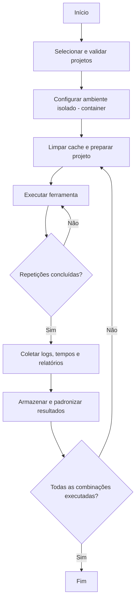

# Plano de Experimento – Scoping e Planejamento

#### Aluno: João Francisco Carvalho Soares de Oliveira Queiroga

## 1. Identificação básica

### 1.1 Título do experimento
Avaliação comparativa da qualidade, velocidade e abrangência de ferramentas de análise de dependências em projetos de software.

### 1.2 ID / código
EXP-ANDEP-001

### 1.3 Versão do documento e histórico de revisão
- v0.1 — Rascunho inicial (23/11/2025): criação das seções 1 e 2.
- v0.2 — Entrega 2 (24/11/2025): criação das seções 3, 4, 5 e 6.
- v0.3 — Entrega 3 (28/11/2025): criação das seções 7, 8 e 9.
- v0.4 — Entrega 4 (01/12/2025): criação das seções 10, 11 e 12.
- v0.5 — Entrega 5 (05/12/2025): criação da seção 13.
- v1.0 — Entrega Final (13/12/2025): Finalização da primeira versão do documento

### 1.4 Datas (criação, última atualização)
- Data de criação: 23 de novembro de 2025.
- Última atualização: 5 de dezembro de 2025.

### 1.5 Autores (nome, área, contato)
João Francisco Carvalho Soares de Oliveira Queiroga — Engenharia de Software — joao.queiroga@example.com

### 1.6 Responsável principal (PI / dono do experimento)
João Francisco Carvalho S. O. Queiroga — estudante (responsável técnico)

### 1.7 Projeto / produto / iniciativa relacionada
Estudo independente de comparação de ferramentas de análise de dependências aplicado a projetos multi-linguagem.

---

## 2. Contexto e problema

### 2.1 Descrição do problema / oportunidade
Ferramentas de análise de dependências são usadas para identificar versões, vulnerabilidades e relações entre pacotes. Existem incertezas sobre três dimensões centrais: (i) qualidade — precisão e completude das detecções (falsos positivos/negativos); (ii) velocidade — tempo requerido para analisar repositórios de diferentes tamanhos; e (iii) abrangência — cobertura de ecossistemas e gerenciadores de pacotes (ex.: Cargo, npm, pip). O experimento visa comparar ferramentas representativas para gerar recomendações práticas e evidências empíricas.

### 2.2 Contexto organizacional e técnico
- Contexto organizacional: trabalho acadêmico conduzido com orientação; uso de repositórios open-source como base experimental.
- Contexto técnico: execução em ambientes reprodutíveis (containers), análise de repositórios públicos em GitHub/GitLab, focalizando projetos em Rust, JavaScript/TypeScript e Python; coleta automatizada de logs e métricas.

### 2.3 Trabalhos e evidências prévias (internos e externos)
- Documentação e whitepapers das ferramentas de mercado; relatórios de auditoria.
- Estudos acadêmicos sobre segurança da cadeia de suprimentos de software e comparações de scanners.
- Execuções piloto em amostras reduzidas para validar procedimentos.

### 2.4 Referencial teórico e empírico essencial
- Conceitos de gestão de dependências, vulnerabilidades e *software supply chain*.
- Métricas: precisão, recall, F1; desempenho: tempo, uso de CPU/RAM; abrangência: número de ecossistemas suportados e profundidade da árvore de dependências.
- Fontes de verdade para vulnerabilidades: bases CVE/NVD e feeds públicos.
- Métodos estatísticos: testes de hipótese, ANOVA, testes não paramétricos, análise de poder.

---

## 3. Objetivos e questões (Goal / Question / Metric)

### 3.1 Objetivo geral
Avaliar a qualidade, velocidade e abrangência de ferramentas de análise de dependências aplicadas a projetos de software multi-linguagem, fornecendo evidências que apoiem decisões de adoção e configuração.

### 3.2 Objetivos específicos
O1 — Avaliar a precisão das ferramentas na identificação de dependências e vulnerabilidades.
O2 — Medir o desempenho das ferramentas em termos de tempo de execução e uso de recursos.
O3 — Analisar a abrangência das ferramentas em diferentes ecossistemas e níveis de profundidade das dependências.
O4 — Comparar a consistência e a concordância dos resultados entre ferramentas ao analisar os mesmos projetos.

### 3.3 Questões de pesquisa / de negócio
Q1.1 — As ferramentas identificam corretamente as dependências presentes nos projetos?
Q1.2 — Qual é a taxa de falsos positivos e falsos negativos na detecção de vulnerabilidades?
Q1.3 — A precisão varia entre linguagens diferentes (Rust, JavaScript/TypeScript, Python)?

Q2.1 — Quanto tempo cada ferramenta leva para analisar projetos de tamanhos distintos?
Q2.2 — Qual é o consumo médio de CPU durante a análise?
Q2.3 — Qual é o consumo médio de memória RAM durante a análise?

Q3.1 — Quantos ecossistemas cada ferramenta suporta nativamente?
Q3.2 — Qual é a profundidade máxima da análise do grafo de dependências?
Q3.3 — Quantos tipos de vulnerabilidades cada ferramenta consegue identificar?

Q4.1 — As ferramentas apresentam resultados consistentes quando analisam o mesmo projeto?
Q4.2 — Há divergências relevantes nas versões detectadas entre ferramentas?
Q4.3 — A variação entre execuções sucessivas da mesma ferramenta é significativa?

### 3.4 Métricas associadas (GQM)

#### Tabela GQM (Objetivo → Pergunta → Métricas)

| Objetivo | Pergunta | Métricas |
|---------|----------|-----------|
| O1 | Q1.1 | M1: Precisão geral, M2: Recall |
| O1 | Q1.2 | M3: Taxa de falsos positivos, M4: Taxa de falsos negativos |
| O1 | Q1.3 | M1: Precisão geral, M5: Precisão por linguagem |
| O2 | Q2.1 | M6: Tempo total de execução, M7: Tempo médio por arquivo |
| O2 | Q2.2 | M8: Uso médio de CPU, M9: Pico de CPU |
| O2 | Q2.3 | M10: Uso médio de RAM, M11: Pico de RAM |
| O3 | Q3.1 | M12: Número de ecossistemas suportados, M13: Número de gerenciadores suportados |
| O3 | Q3.2 | M14: Profundidade da árvore de dependências, M6: Tempo total de execução |
| O3 | Q3.3 | M5: Precisão por linguagem, M3: Taxa de falsos positivos |
| O4 | Q4.1 | M1: Precisão geral, M4: Taxa de falsos negativos |
| O4 | Q4.2 | M15: Divergência de versões entre ferramentas, M16: Divergência de vulnerabilidades |
| O4 | Q4.3 | M17: Variação entre execuções, M6: Tempo total de execução |

#### Tabela geral das métricas (descrição e unidade)

| Métrica | Descrição | Unidade |
|--------|-----------|---------|
| M1 — Precisão geral | Proporção de detecções corretas sobre o total esperado | Percentual |
| M2 — Recall | Proporção de dependências esperadas que foram detectadas | Percentual |
| M3 — Taxa de falsos positivos | Itens detectados incorretamente | Percentual |
| M4 — Taxa de falsos negativos | Itens não detectados, mas presentes | Percentual |
| M5 — Precisão por linguagem | Precisão calculada por ecossistema específico | Percentual |
| M6 — Tempo total de execução | Tempo para completar a análise | Segundos |
| M7 — Tempo médio por arquivo | Tempo médio gasto por arquivo processado | Milissegundos |
| M8 — Uso médio de CPU | Média percentual de uso da CPU durante a execução | Percentual |
| M9 — Pico de CPU | Maior uso registrado durante a análise | Percentual |
| M10 — Uso médio de RAM | Quantidade média de memória utilizada | Megabytes |
| M11 — Pico de RAM | Maior uso registrado de memória | Megabytes |
| M12 — Número de ecossistemas suportados | Quantidade de linguagens/ecossistemas analisáveis | Contagem |
| M13 — Número de gerenciadores suportados | Total de gerenciadores de pacotes compatíveis | Contagem |
| M14 — Profundidade da árvore de dependências | Número máximo de níveis analisados | Níveis |
| M15 — Divergência de versões | Diferença de versões detectadas entre ferramentas | Contagem |
| M16 — Divergência de vulnerabilidades | Diferença de vulnerabilidades identificadas entre ferramentas | Contagem |
| M17 — Variação entre execuções | Variação dos resultados em múltiplas execuções | Percentual |

---

## 4. Escopo e contexto do experimento

### 4.1 Escopo funcional / de processo
Inclui: execução automatizada de ferramentas de análise de dependências em repositórios open-source, detecção de dependências e vulnerabilidades, coleta de métricas e comparação estatística.
Exclui: análise manual de código-fonte, auditoria de segurança profunda e integração contínua em pipelines de produção (salvo replicação futura).

### 4.2 Contexto do estudo
Estudo acadêmico em ambiente controlado, utilizando repositórios públicos em GitHub/GitLab, com foco em projetos nas linguagens Rust, JavaScript/TypeScript e Python. Ambientes reprodutíveis via containers.

### 4.3 Premissas
- Ferramentas selecionadas funcionam em suas configurações padrão;
- Repositórios escolhidos são representativos dos ecossistemas;
- Bases públicas de vulnerabilidades (CVE/NVD) estão atualizadas durante a coleta.

### 4.4 Restrições
- Tempo limitado para execução e repetição de testes;
- Uso preferencial de ferramentas open-source ou versões gratuitas;
- Dependência da disponibilidade de serviços externos e APIs.

### 4.5 Limitações previstas
- Generalização limitada para ecossistemas não avaliados;
- Variação de desempenho pela máquina física apesar do uso de containers;
- Atualizações das ferramentas podem alterar resultados futuros.

---

## 5. Stakeholders e impacto esperado

### 5.1 Stakeholders principais
Estudante responsável, orientador, banca avaliadora, desenvolvedores e equipes de engenharia, e a comunidade técnica interessada em práticas de análise de dependências.

### 5.2 Interesses e expectativas dos stakeholders
- Estudante: obter evidências sólidas para análise metodológica.
- Orientador/banca: rigor metodológico e clareza nos resultados.
- Desenvolvedores/equipes: recomendações práticas sobre ferramentas.
- Comunidade: insights sobre limitações e vantagens de cada ferramenta.

### 5.3 Impactos potenciais no processo / produto
O experimento pode influenciar seleção de ferramentas em pipelines, guiar políticas de segurança e impactar carga de trabalho durante a fase de coleta. Em médio prazo, resultados podem reduzir retrabalho ao orientar escolhas mais adequadas.

---

## 6. Riscos de alto nível, premissas e critérios de sucesso

### 6.1 Riscos de alto nível
- Falhas ou travamentos das ferramentas durante execução;
- Incompatibilidades entre versões de gerenciadores e ferramentas;
- Indisponibilidade de APIs ou bases públicas;
- Viés na seleção de projetos;
- Tempo insuficiente para repetir execuções necessárias.

### 6.2 Critérios de sucesso globais
- Execução reprodutível das ferramentas nos projetos selecionados;
- Coleta completa das métricas definidas;
- Dados suficientes para responder às questões do GQM com validade estatística mínima;
- Documentação do processo e resultados.

### 6.3 Critérios de parada antecipada (pré-execução)
- Falha crítica que impeça coleta de dados em diversas ferramentas;
- Indisponibilidade prolongada de APIs essenciais;
- Impossibilidade de executar repetições suficientes para garantir poder estatístico.

---

## 7. Modelo conceitual e hipóteses

### 7.1 Modelo conceitual do experimento
O modelo assume que fatores como tamanho do projeto e complexidade do grafo de dependências influenciam as respostas: tempo de execução, precisão das detecções e abrangência da análise. A interação entre ferramentas e características do repositório pode gerar variações mensuráveis em cada métrica.

### 7.2 Hipóteses formais (H0, H1)
- H0 (nula): não há diferença estatisticamente significativa entre as ferramentas nas métricas de qualidade, velocidade e abrangência.
- H1 (alternativa): existe diferença estatisticamente significativa entre pelo menos duas ferramentas em pelo menos uma das métricas.

### 7.3 Nível de significância e considerações de poder
Nível de significância adotado: α = 0.05. Objetivo de poder estatístico: ≥ 0.8; cálculo de tamanho amostral será usado para justificar número de repetições e projetos por grupo.

---

## 8. Variáveis, fatores, tratamentos e objetos de estudo

### 8.1 Objetos de estudo
Repositórios de software com manifests de dependência (por exemplo, Cargo.toml, package.json, requirements.txt) nas linguagens alvo.

### 8.2 Sujeitos / participantes (visão geral)
Não há sujeitos humanos; as unidades de análise são os projetos de software.

### 8.3 Variáveis independentes (fatores) e seus níveis
- Tamanho do conjunto de dependências: pequeno, médio, grande.
- Complexidade do grafo: baixa, alta.
- Ecossistema/language: Rust, JavaScript/TypeScript, Python (fator de bloqueio/controlador).

### 8.4 Tratamentos (condições experimentais)
Cada tratamento corresponde à combinação de níveis (por exemplo, projeto de tamanho grande + grafo de alta complexidade). As ferramentas serão aplicadas a projetos representando cada tratamento.

### 8.5 Variáveis dependentes (respostas)
- Tempo total de análise (M6);
- Precisão geral e por linguagem (M1, M5);
- Taxas de falsos positivos/negativos (M3, M4);
- Número de dependências detectadas e cobertura (M12, M14).

### 8.6 Variáveis de controle / bloqueio
- Ambiente (containers), hardware, versões das ferramentas e gerenciadores, e políticas de limpeza de cache serão mantidos constantes.

### 8.7 Possíveis variáveis de confusão conhecidas
- Repositórios com metadados incompletos;
- Dependências internas não publicadas;
- Variações temporais nas bases de vulnerabilidades.

---

## 9. Desenho experimental

### 9.1 Tipo de desenho (completamente randomizado, blocos, fatorial, etc.)
Desenho fatorial (2 fatores principais: tamanho × complexidade) com blocos por ecossistema para controlar efeito de linguagem.

### 9.2 Randomização e alocação
Projetos serão alocados aleatoriamente aos tratamentos dentro de cada bloco/ecossistema para reduzir viés de seleção.

### 9.3 Balanceamento e contrabalanço
Cada combinação de fatores terá o mesmo número de projetos (balanceamento). Execuções serão repetidas em ordens variadas para mitigar efeitos de ordem.

### 9.4 Número de grupos e sessões
Seis combinações principais (3 tamanhos × 2 complexidades) com n projetos por combinação; número de repetições conforme cálculo de poder.

---

## 10. População, sujeitos e amostragem

### 10.1 População-alvo
Projetos de software open-source que usam gerenciadores de dependência típicos (Cargo, npm, pip) e que representem diferentes tamanhos e níveis de complexidade.

### 10.2 Critérios de inclusão de sujeitos
- Manifesto de dependências válido;
- Repositório público acessível;
- Mínimo de 5 dependências diretas.

### 10.3 Critérios de exclusão de sujeitos
- Repositórios privados ou inacessíveis;
- Projetos sem manifesto ou com manifesto corrompido;
- Projetos que exigem credenciais para build/test.

### 10.4 Tamanho da amostra planejado (por grupo)
Planejado: 30 projetos no total, 5 por combinação (ajustável conforme cálculo de poder).

### 10.5 Método de seleção / recrutamento
Amostragem aleatória simples de repositórios populares e ativos, com estratificação por ecossistema e tamanho.

### 10.6 Treinamento e preparação dos sujeitos
Não aplicável a sujeitos humanos; preparação técnica inclui validação do ambiente e teste do pipeline de coleta.

---

## 11. Instrumentação e protocolo operacional

### 11.1 Instrumentos de coleta (questionários, logs, planilhas, etc.)
- Logs de execução das ferramentas;
- Arquivos de saída/relatórios das ferramentas;
- Scripts automatizados de medição de tempo e uso de recursos;
- Planilha padronizada para consolidação.

### 11.2 Materiais de suporte (instruções, guias)
Guia operacional com passos de execução, parâmetros padrão, checklist de preparação e template de registro de falhas.

### 11.3 Procedimento experimental (protocolo – visão passo a passo)

### 11.4 Plano de piloto (se haverá piloto, escopo e critérios de ajuste)
Piloto com 2 projetos (um simples, um complexo). Critérios de ajuste: inconsistência nos logs, falhas de execução ou métricas inválidas; ajustes no script ou no ambiente antes da execução em larga escala.

---

## 12. Plano de análise de dados (pré-execução)

### 12.1 Estratégia geral de análise (como responderá às questões)
- Comparações entre ferramentas por métricas definidas;
- Análise dentro de blocos por ecossistema;
- Relatórios de diferenças estatisticamente significativas e interpretação prática.

### 12.2 Métodos estatísticos planejados
- Testes de normalidade (Shapiro-Wilk);
- ANOVA factorial ou Kruskal-Wallis para comparações entre grupos;
- Testes post-hoc (Tukey ou Dunn) conforme necessário;
- Teste de proporções para métricas categóricas;
- Cálculo de tamanhos de efeito e intervalos de confiança.

### 12.3 Tratamento de dados faltantes e outliers
- Dados faltantes: investigar causa; excluir somente se decorrente de falha técnica; documentar motivos.
- Outliers: identificar por IQR; avaliar se representam erro técnico; decidir exclusão ou inclusão com justificativa.

### 12.4 Plano de análise para dados qualitativos (se houver)
Análise de conteúdo básica para seções textuais dos relatórios; categorização de clareza, completude e utilidade segundo códigos predefinidos.

## 13. Avaliação de validade

### 13.1 Validade de conclusão
Ameaças incluem variabilidade nos tempos de execução, erros de medição e tamanho reduzido da amostra. A mitigação envolve repetição das execuções, automação completa da coleta e uso de testes estatísticos adequados ao tipo de distribuição.

### 13.2 Validade interna
Há risco de interferência do ambiente (carga da máquina, versão do sistema, cache). A mitigação será feita com ambiente isolado, execução sequencial e limpeza de cache entre rodadas.

### 13.3 Validade de constructo
As métricas podem não capturar totalmente aspectos como “qualidade” ou “abrangência”. Para mitigar, cada constructo foi associado a múltiplas métricas, definidas operacionalmente com critérios claros.

### 13.4 Validade externa
Os resultados podem não se aplicar a ecossistemas fora de Rust, JavaScript/TypeScript e Python ou a projetos muito maiores. A mitigação será selecionar projetos variados e documentar as características da amostra para permitir replicação.

### 13.5 Resumo das ameaças e mitigação
As principais ameaças envolvem limitações de ambiente, escopo restrito e potencial ruído nas medidas. As ações de mitigação incluem automação, ambiente controlado, múltiplas métricas por conceito e documentação detalhada para facilitar replicação.

## 14. Ética, privacidade e conformidade

### 14.1 Questões éticas
O experimento não envolve participantes humanos, entrevistas ou coleta de dados pessoais. Todos os objetos de estudo são projetos de software open-source, disponibilizados publicamente. Não há risco de dano direto a indivíduos ou organizações. O uso dos repositórios respeita as licenças associadas a cada projeto analisado.

### 14.2 Consentimento informado
Não se aplica, pois não há sujeitos humanos envolvidos no experimento. Os dados analisados são públicos e acessíveis sem autenticação.

### 14.3 Privacidade e proteção de dados
Não serão coletados dados pessoais, sensíveis ou identificáveis. Os dados armazenados consistem apenas em métricas técnicas, logs de execução e relatórios de ferramentas. Esses dados serão armazenados localmente, com controle de acesso restrito ao autor do experimento, e utilizados exclusivamente para fins acadêmicos.

### 14.4 Aprovações necessárias
Por se tratar de um experimento técnico sem envolvimento humano, não é necessária aprovação de comitê de ética. A validação ocorre no âmbito acadêmico, com acompanhamento e aprovação do orientador da disciplina.

---

## 15. Recursos, infraestrutura e orçamento

### 15.1 Recursos humanos e papéis
- Estudante pesquisador: planejamento, execução do experimento, coleta e análise dos dados.
- Orientador da disciplina: acompanhamento metodológico, validação do planejamento e avaliação dos resultados.

### 15.2 Infraestrutura técnica necessária
- Computador pessoal com sistema operacional Linux ou Windows.
- Ferramentas de análise de dependências selecionadas para o experimento.
- Ambiente de execução baseado em containers (ex.: Docker).
- Scripts de automação para execução e coleta de métricas.
- Acesso à internet para obtenção de repositórios e consultas a bases públicas.

### 15.3 Materiais e insumos
- Repositórios open-source públicos.
- Bases públicas de vulnerabilidades (ex.: CVE, NVD).
- Planilhas ou arquivos CSV para consolidação dos dados.
- Editor de texto e ferramentas estatísticas para análise.

### 15.4 Orçamento e custos estimados
Não há custos financeiros diretos. Todas as ferramentas utilizadas são open-source ou gratuitas. O principal custo está relacionado ao tempo de dedicação do estudante e ao uso de infraestrutura computacional pessoal.

---

## 16. Cronograma, marcos e riscos operacionais

### 16.1 Macrocronograma

- **Semana 1:** revisão final do plano experimental e validação metodológica com o orientador.
- **Semana 2:** implementação e ajustes dos scripts de automação e configuração do ambiente experimental.
- **Semana 3:** execução do experimento piloto e correção de falhas identificadas.
- **Semana 4:** execução completa do experimento com todos os projetos e tratamentos definidos.
- **Semana 5:** consolidação dos dados coletados e análise estatística dos resultados.
- **Semana 6:** interpretação dos resultados, revisão das ameaças à validade e preparação da entrega final.

### 16.2 Dependências entre atividades
- A execução depende da conclusão do planejamento e da validação do protocolo.
- A análise estatística depende da coleta completa e correta das métricas.
- A consolidação dos resultados depende da execução bem-sucedida de todas as ferramentas.

### 16.3 Riscos operacionais e plano de contingência
- Falhas de execução das ferramentas: mitigadas por testes piloto e documentação de erros.
- Indisponibilidade temporária de repositórios: mitigada pela seleção de projetos alternativos.
- Problemas de ambiente: mitigados por uso de containers e scripts reproduzíveis.

---

## 17. Governança do experimento

### 17.1 Papéis e responsabilidades formais
O estudante é responsável pelo planejamento, execução, coleta e análise dos dados. O orientador atua como revisor metodológico e avaliador do experimento.

### 17.2 Ritos de acompanhamento
- Revisões periódicas do planejamento com o orientador.
- Checkpoints antes da execução completa.
- Revisão final dos resultados e conclusões.

### 17.3 Processo de controle de mudanças no plano
Alterações no escopo, métricas ou protocolo devem ser documentadas em nova versão do plano, com justificativa clara e aprovação do orientador antes da execução.

---

## 18. Plano de documentação e reprodutibilidade

### 18.1 Repositórios e convenções de nomeação
Todo o material do experimento será organizado em repositório versionado, contendo:
- Documento do plano experimental.
- Scripts de execução.
- Dados coletados.
- Resultados intermediários e finais.

### 18.2 Templates e artefatos padrão
Serão utilizados templates padronizados para:
- Registro de métricas.
- Relato de falhas de execução.
- Consolidação dos resultados estatísticos.

### 18.3 Plano de empacotamento para replicação futura
O experimento será documentado de forma que terceiros possam replicá-lo, incluindo instruções de ambiente, versões das ferramentas, parâmetros utilizados e estrutura dos dados.

---

## 19. Plano de comunicação

### 19.1 Públicos e mensagens-chave
- Orientador e avaliadores: objetivos, metodologia, resultados e limitações.
- Comunidade acadêmica: evidências empíricas e implicações metodológicas.

### 19.2 Canais e frequência de comunicação
A comunicação ocorrerá por meio de reuniões de orientação, entregas formais da disciplina e documentação escrita.

### 19.3 Pontos de comunicação obrigatórios
- Aprovação do plano experimental.
- Comunicação de ajustes relevantes no protocolo.
- Apresentação dos resultados finais.

---

## 20. Critérios de prontidão para execução (Definition of Ready)

### 20.1 Checklist de prontidão
- Plano experimental revisado e aprovado.
- Ferramentas selecionadas e instaladas.
- Scripts de automação testados.
- Ambiente de execução validado.
- Projetos selecionados conforme critérios.

### 20.2 Aprovações finais para iniciar a operação
O início da execução do experimento depende da validação final do plano pelo orientador da disciplina, registrada por meio de entrega oficial ou confirmação formal.
